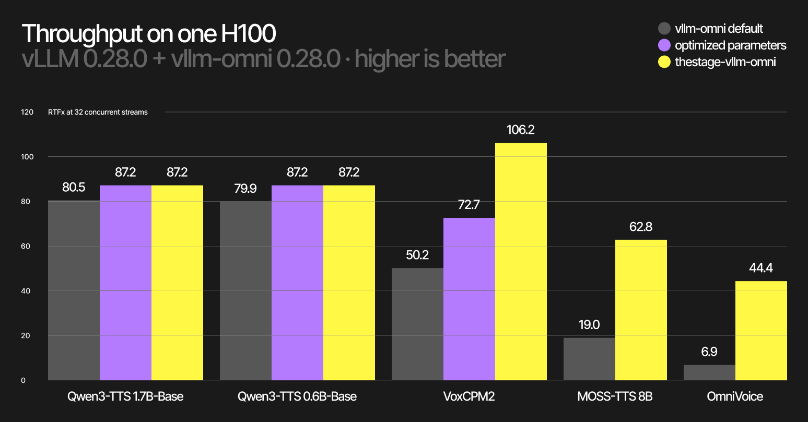
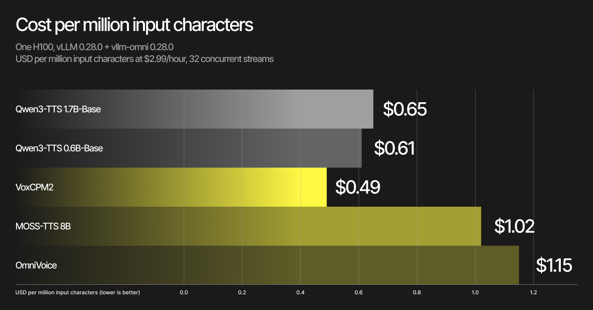

# TheTalker: Serving open text-to-speech models

[](LICENSE)
[](https://github.com/vllm-project/vllm)
[](https://github.com/vllm-project/vllm-omni)
[](#support-matrix-and-system-requirements)


## Overview

Model cards report how fast a TTS model synthesizes one utterance offline. They
do not say what happens with thirty-two concurrent clients, whether audio arrives
fast enough to play without gaps, or how many streaming users one GPU sustains.
This repository is the benchmark client that measures that, plus everything
needed to reproduce the measurements.

It contains:

- **A benchmark client** for any server that speaks the OpenAI
  `POST /v1/audio/speech` API with `stream: true` and raw PCM, including
  [vllm-omni](https://github.com/vllm-project/vllm-omni). It records every
  chunk's arrival time and derives RTFx, time to first audio and stream
  continuity from that timeline.
- **Deploy configs**, two per model: the file vllm-omni 0.28.0 ships, and the
  optimized serving parameters the published numbers were measured with. They
  are shipped as package data and resolved by name with `thetalker-deploy`, so a
  config is one shell substitution away from `vllm serve`.
- **Examples**: a downloader for a public-domain reference clip, a serve
  wrapper, a single curl request, a streaming client that prints what a player
  would have heard, a concurrency sweep, a locust load script.
- **Tutorials**:
  [reproducing a table end to end](tutorials/reproduce_benchmarks.md),
  [what each serving parameter does](tutorials/serving_parameters.md),
  [how the streaming metrics are defined](tutorials/streaming_metrics.md), and
  [the known defects of vllm-omni 0.28.0](tutorials/known_issues_0.28.md) that
  these numbers run into.

Five checkpoints are covered: Qwen3-TTS 1.7B-Base and 0.6B-Base, VoxCPM2,
MOSS-TTS 8B and OmniVoice.

`thestage-vllm-omni`, TheStage AI's serving library for these models, is measured
as a third configuration in the Benchmarks tables. It is a separately licensed,
access-token-gated package, not on PyPI, and its Qwen3-TTS and OmniVoice overlays
need it installed. It ships its own deploy overlays, applies them by default when `vllm serve`
gets no `--deploy-config`, and names them through a `thestage-vllm-omni-overlay`
command; two of those names -- `batch32` and `tuned` -- resolve to the same
configuration as `voxcpm2_optimized` and `moss_optimized` here, checked through
vllm-omni's own loader. The Qwen3-TTS and OmniVoice overlays additionally switch
on library-only keys, so no config in this repository reproduces them: that third
configuration is not reproducible from this repository alone.

### Repository layout

```
pyproject.toml     packaging: the thetalker package and its two console scripts
conftest.py        lets pytest import thetalker from a plain checkout
thetalker/         the installable package
  client.py          the load-generating client (CLI: thetalker-bench)
  metrics.py         RTFx, TTFA and continuity math, one implementation
  deploy_configs.py  config lookup behind thetalker-deploy
  deploy/            12 deploy configs, default and optimized per model
benchmark/
  run_benchmark.py   entry point for a checkout without an install
  gpu_monitor.py     nvidia-smi sampler, peak memory of a served model
  prompts/           Seed-TTS-Eval EN prompt sets (100 / 200 utterances)
  test_*.py          offline tests, no server and no GPU needed
  README.md          protocol, metric definitions, per-table commands
examples/          reference clip, serve, request, streaming client, sweep, locust
tutorials/         reproduction, parameters, metrics, known issues
images/            the figures used below
```

## Table of Contents

- [Features](#features)
- [Quick start](#quick-start)
- [Support Matrix and System Requirements](#support-matrix-and-system-requirements)
- [Usage and Deployment](#usage-and-deployment)
- [Benchmarks](#benchmarks)
- [Enterprise License Summary](#enterprise-license-summary)
- [Contact](#contact)

---

## Features

- **Streaming metrics, not offline ones.** RTFx aggregated over a whole load
  point; time to first audio in two forms, first byte and audible; stream
  continuity, the share of requests a real-time player could have played without
  running dry.
- **Continuity comparable to vllm-omni.** The underrun computation is a verbatim
  port of `vllm_omni/benchmarks/audio_continuity.py::compute_continuity_stats`,
  so a continuity number here means the same thing as one published upstream.
- **Audible time to first audio.** First-byte latency plus the leading silence
  the model itself generates, detected from the PCM. A model that answers in
  80 ms and then plays 300 ms of silence is not a model that answers in 80 ms.
- **A paired A/B protocol.** 300 requests per point after a warmup, both sides of
  a comparison back to back in one session on the same prompts and the same
  arrival schedule, one server at a time on an otherwise empty GPU.
- **Deploy configs as data.** Every measured configuration is a file in this
  repository, resolved by name: `thetalker-deploy qwen3tts17b_optimized`. The
  optimized files are thin overlays on the shipped defaults, so the delta of any
  claim is readable in one screen.
- **Per-request evidence.** `records.jsonl` keeps the full chunk timeline, so any
  aggregate in the tables below can be recomputed or disputed from the raw run.

---

## Quick start

### 1. Install

```shell
git clone https://github.com/TheStageAI/TheTalker.git
cd TheTalker
pip install .[nvidia]
```

`[nvidia]` pulls the serving framework the tables were measured on, vLLM 0.28.0
and vllm-omni 0.28.0, naming the vLLM wheel by URL because the PyPI build
targets CUDA 13. That URL is a direct reference, which is valid for this git or
local install; a published release of `thetalker` cannot carry one in its
metadata and states the same pin as an instruction instead.

The install brings the `thetalker` package with the deploy configs and the
`thetalker-deploy` and `thetalker-bench` commands. Everything else is an
optional group, so a benchmark client on a machine with no GPU stays small:

| Install | Adds | Needed by |
|---|---|---|
| `pip install .` | numpy | the client, `thetalker-deploy`, `thetalker-bench` |
| `pip install .[nvidia]` | vLLM 0.28.0, vllm-omni 0.28.0, `voxcpm` | serving any model here |
| `pip install .[examples]` | `datasets`, `soundfile` | `examples/get_reference.py` (step 3) |
| `pip install .[load]` | `locust`, `requests` | `examples/load_test_locust.py` |
| `pip install .[test]` | `pytest` | `pytest benchmark` |

Groups combine: `pip install .[nvidia,examples]`.

The `nvidia` group also installs `flashinfer-jit-cache`, the precompiled FlashInfer
kernels for this vLLM pin (a 1.5 GB wheel), so the first start of a server needs
no CUDA toolkit and compiles nothing.

Use `pip install -e .[...]` to install in place.

### 2. TheStage AI serving library, optional

`thestage-vllm-omni` is TheStage AI's serving library. It is a separately
licensed, access-token-gated package, not on PyPI. The Benchmarks tables report
it as a third configuration; MOSS-TTS and OmniVoice need it installed to start at
all, because it carries the fixes to vllm-omni 0.28.0 they depend on.
```shell
pip install thestage-vllm-omni --extra-index-url https://thestage.jfrog.io/artifactory/api/pypi/pypi-thestage-ai-production/simple
```

Go to [app.thestage.ai](https://app.thestage.ai), log in and generate an API
token on your profile page. Make it available to the server:

```shell
export THESTAGE_AUTH_TOKEN=<YOUR_API_TOKEN>
```

The `thestage` CLI (`thestage config set --access-token`) stores the same token
instead, but it pins an older `typer` than vLLM, so install it outside this
environment. Nothing else to run: the library activates when Python starts and edits nothing
in the installed vllm-omni. With it installed, `vllm serve <model> --omni
--trust-remote-code` alone serves each of the five models with the library's own
configuration; the `--deploy-config` lines below select a configuration from the
tables instead, and always win.

### 3. A reference clip

All five checkpoints in step 4 are served in the `Base` task type, which is voice
cloning: every request carries a reference recording of the voice to imitate and
the exact transcript of that recording. What the reference needs to be:

- a mono WAV, 5 to 15 seconds of a single speaker;
- clean: one voice, no music, no overlapping speech;
- accompanied by its transcript, word for word, in the request's `ref_text`.

`examples/get_reference.py` downloads one utterance from LibriSpeech
test-clean, writes `reference.wav` and prints its transcript:

```shell
pip install .[examples]
python examples/get_reference.py --out reference.wav
```

Every command below uses `--ref-audio reference.wav` and the transcript that
command prints. Substitute your own recording to clone a different voice.

Checkpoints that ship built-in speakers, such as the Qwen3-TTS CustomVoice
variants, need no reference at all: they take `--task-type CustomVoice` with a
`--speaker` name instead. This repository's tables are all `Base`, so the
commands here are written for the voice-cloning path.

### 4. Serve a model

`thetalker-deploy <name>` prints the path of a ready deploy file; without arguments
it lists every name with the model it serves. One line per model:

```shell
vllm serve Qwen/Qwen3-TTS-12Hz-1.7B-Base --omni --trust-remote-code --port 8091 \
    --deploy-config "$(thetalker-deploy qwen3tts17b_optimized)"

vllm serve Qwen/Qwen3-TTS-12Hz-0.6B-Base --omni --trust-remote-code --port 8091 \
    --deploy-config "$(thetalker-deploy qwen3tts06b_optimized)"

# sized for an 80 GB card; on a smaller one serve voxcpm2_default
vllm serve openbmb/VoxCPM2 --omni --trust-remote-code --port 8091 \
    --deploy-config "$(thetalker-deploy voxcpm2_optimized)"

# needs thestage-vllm-omni installed; does not start on stock vllm-omni 0.28.0
vllm serve OpenMOSS-Team/MOSS-TTS --omni --trust-remote-code --port 8091 \
    --deploy-config "$(thetalker-deploy moss_optimized)"

# needs thestage-vllm-omni installed; does not start on stock vllm-omni 0.28.0
vllm serve k2-fsa/OmniVoice --omni --trust-remote-code --port 8091 \
    --deploy-config "$(thetalker-deploy omnivoice_optimized)"
```

MOSS-TTS and OmniVoice need fixes that are not in stock vllm-omni 0.28.0:
neither `moss_default` nor `moss_optimized` starts a server on it, and
`omnivoice_optimized` requests bf16 on a path that fails without the fix. Both
fixes come with `thestage-vllm-omni` from step 2, nothing to apply by hand;
[tutorials/known_issues_0.28.md](tutorials/known_issues_0.28.md) is the long
form. The other three models run on stock vllm-omni.

Add `--host 0.0.0.0` to serve on the network. The first start compiles kernels
and captures CUDA graphs, 5 to 10 minutes on a cold machine (MOSS-TTS is the
slowest); later starts take a few minutes. Replace `_optimized` with `_default` in any of
those lines to serve the configuration vllm-omni ships.

`thetalker-deploy` does not print the packaged file itself: it writes a copy under
`~/.cache/thetalker/deploy/<name>.yaml` with the config's `base_config` line made
absolute, and prints that copy. Rerunning the command overwrites it, so edit a
copy of your own rather than the printed path, or pass `--out-dir <dir>` to put
it somewhere stable. By default the base resolves to the pinned default shipped
in this package; `--stock-base` resolves it against the deploy directory of the
installed vllm-omni instead. On 0.28.0 the two are equal, and a test pins that.

### 5. Drive it

```shell
python benchmark/run_benchmark.py \
    --port 8091 \
    --texts-jsonl benchmark/prompts/seed_tts_eval_en_100.jsonl \
    --task-type Base \
    --ref-audio reference.wav --ref-text "<the transcript step 3 printed>" \
    --concurrency 8 --requests 300 --warmup 8 --seed 42 \
    --out-dir out/c8
```

---

## Support Matrix and System Requirements

`thetalker-deploy` resolves the configs by the names in the third column;
`_default` is the file vllm-omni 0.28.0 ships, `_optimized` the same file with
the serving parameters below. The fourth column is the name
`thestage-vllm-omni-overlay` uses for that family when the library is installed,
and the configuration the library serves when `vllm serve` gets no
`--deploy-config`.

| Model | Served model id | Deploy configs | thestage-vllm-omni overlay | What `_optimized` changes | Model weights | RTFx c8 / c32 |
|---|---|---|---|---|---|---|
| Qwen3-TTS 1.7B-Base | `Qwen/Qwen3-TTS-12Hz-1.7B-Base` | `qwen3tts17b_{default,optimized}` | `chunk75_init16` | first chunk 1 to 16 frames, chunk 25 to 75, decode-graph capture sizes retuned | 4.4 GiB | 49.64 / 87.24 |
| Qwen3-TTS 0.6B-Base | `Qwen/Qwen3-TTS-12Hz-0.6B-Base` | `qwen3tts06b_{default,optimized}` | `chunk75_init16` | the same keys as the 1.7B | 2.5 GiB | 53.13 / 87.20 |
| VoxCPM2 | `openbmb/VoxCPM2` | `voxcpm2_{default,optimized}` | `batch32` | `max_num_seqs` and decode-graph batch limit 8 to 32 | 4.9 GiB | 56.18 / 106.17 |
| MOSS-TTS 8B | `OpenMOSS-Team/MOSS-TTS` | `moss_{default,optimized}` | `tuned` | `max_num_seqs` 4 to 32 on stage 0, 1 to 8 on stage 1 | 24.5 GiB | 29.91 / 62.76 |
| OmniVoice | `k2-fsa/OmniVoice` | `omnivoice_{default,optimized}` | `batch` | dtype fp32 to bf16 | 2.2 GiB | 41.90 / 44.36 |

Model weights are the loaded-weight footprint the server reports on an H100 80GB
at the recommended setting, summed over the pipeline's stages; KV cache and
CUDA-graph pools are on top of it and are sized by `gpu_memory_utilization`.
OmniVoice on the shipped fp32 configuration is twice the figure shown. RTFx is
also at the recommended setting, which for VoxCPM2, MOSS-TTS and OmniVoice
includes thestage-vllm-omni; see [Benchmarks](#benchmarks) for the split.

Qwen3-TTS and VoxCPM2 stream audio chunk by chunk. MOSS-TTS and OmniVoice
deliver the whole utterance at the end, so continuity and TTFA are not separable
for them: first audio equals total response time.

`batch32` and `tuned` resolve to the same configuration as the matching
`_optimized` file here and are accepted by `thetalker-deploy` as aliases.
The library's default Qwen3-TTS overlay, `chunk75_init16`, resolves to the same
configuration as `qwen3tts17b_optimized` and `qwen3tts06b_optimized`; its
`chunk75_refonce_predf3f` and `batch` overlays additionally switch on
library-only keys, so no config in this repository reproduces those two.

What each of those keys does, and how the CUDA-graph capture ladder is derived:
[tutorials/serving_parameters.md](tutorials/serving_parameters.md). Why MOSS-TTS
and OmniVoice need a patched vllm-omni and why `voxcpm2_optimized` is an 80 GB
config: [tutorials/known_issues_0.28.md](tutorials/known_issues_0.28.md).

### System requirements

- **Measured on:** one NVIDIA H100 80GB SXM. Every number below is from that
  card.
- **Supported GPUs:** any NVIDIA GPU vLLM supports and the model fits on. The
  `_optimized` configs pin concurrency and memory settings chosen for an 80GB
  card; on a smaller card serve the `_default` config.
- **Driver:** 580 as measured; CUDA 12.9 wheels.
- **Operating system:** Ubuntu 20.04 or later.
- **Python:** 3.10-3.12 for the benchmark client; vllm-omni 0.28.0 itself needs
  3.11 or later.
- **Client host:** the benchmark client needs no GPU and no vllm-omni; numpy is
  its only dependency.

---

## Usage and Deployment

### Serve

```shell
examples/serve.sh qwen3tts17b_optimized 8091
```

The wrapper resolves the config with `thetalker-deploy` and picks the checkpoint
that config was measured with; `MODEL=<hf-id>` overrides the checkpoint.

### One request

A request is an OpenAI `audio/speech` call. For a voice-cloning checkpoint it
carries the reference clip and its transcript (Quick start step 3); the reply is
24 kHz mono PCM.

The body is piped rather than passed as an argument: a 10 s reference clip is
about 600 KB of base64, and the kernel caps a single argument at 128 KB, so
inlining it in `-d "{...}"` fails with "Argument list too long".

```shell
REF_AUDIO=reference.wav
REF_TEXT="<the transcript of that recording, word for word>"

{
    printf '{"input": "The quick brown fox jumps over the lazy dog.", '
    printf '"task_type": "Base", "language": "English", '
    printf '"ref_audio": "data:audio/wav;base64,'
    base64 -w0 "$REF_AUDIO"
    printf '", "ref_text": "%s", ' "$REF_TEXT"
    printf '"stream": true, "stream_format": "audio", "response_format": "pcm"}'
} | curl -sS http://127.0.0.1:8091/v1/audio/speech \
    -H 'Content-Type: application/json' \
    --data-binary @- --output out.pcm
```

The same call is in `examples/request.sh`. `task_type` selects the mode a
checkpoint supports: `Base` clones the reference clip, `CustomVoice` takes a
preset `speaker`, `VoiceDesign` takes an `instructions` description.

### Streaming

`examples/run_streaming.py` sends one streaming request, writes the audio to a
WAV, and reports what a player would have heard: first-byte latency, audible
latency, and whether playback would have stalled.

```shell
python examples/run_streaming.py \
    --ref-audio reference.wav --ref-text "<the transcript of that recording>" \
    --text "The quick brown fox jumps over the lazy dog." \
    --out out.wav
```

The server streams raw PCM at the model's own rate and the client writes the WAV
header from `--sample-rate`, default 24000. VoxCPM2 streams at 48000 Hz: pass
`--sample-rate 48000` for it (to the streaming example and to
`thetalker-bench`), or the recording plays slowed down and pitched low.
`thetalker-deploy --sample-rate <name>` prints the rate of the model a config serves:

```shell
python examples/run_streaming.py --sample-rate "$(thetalker-deploy --sample-rate voxcpm2_optimized)" ...
```

It prints one block per request:

```
wrote out.wav (<audio seconds> in <n> chunks)
TTFA first byte : <seconds>
TTFA audible    : <seconds> (leading silence <seconds>)
longest gap     : <seconds>
playback        : no stall | WOULD HAVE STALLED -- worst underrun <seconds>
```

### Load

`examples/run_sweep.sh` runs the benchmark protocol at c8 and c32 against a
running server. `examples/load_test_locust.py` holds a server under open-loop
locust load and reports time to first audio separately from total response time.

---

## Benchmarks

Five open TTS checkpoints on one H100, all measured on vLLM 0.28.0 with vllm-omni
0.28.0 under concurrent streaming load. Full protocol and per-table commands:
[benchmark/README.md](benchmark/README.md). What the three metrics mean and where
they mislead: [tutorials/streaming_metrics.md](tutorials/streaming_metrics.md).
One model reproduced end to end, including a short smoke run to check the path
before spending an hour on it:
[tutorials/reproduce_benchmarks.md](tutorials/reproduce_benchmarks.md).

### Throughput

The deploy files vllm-omni ships are tuned for a single-utterance demo. Editing
the documented serving keys, meaning streaming chunk sizes, concurrency limits,
per-stage memory and dtype, is still the larger half of the available speed
wherever it is reachable at all. thestage-vllm-omni is measured on top of that,
so its column is the part configuration cannot reach.

| Model | What the optimized parameters change | Optimized parameters over the vllm-omni default, c8 / c32 | thestage-vllm-omni over the optimized parameters, c8 / c32 | RTFx at the recommended setting, c8 / c32 |
|---|---|---|---|---|
| VoxCPM2 | `max_num_seqs` and decode-graph batch limit 8 to 32 | 1.00x / 1.45x | 1.21x / 1.50x | 56.18 / 106.17 |
| Qwen3-TTS 0.6B-Base | first chunk 1 to 16 frames, chunk 25 to 75, decode-graph capture sizes retuned | 1.03x / 1.09x | 1.0x / 1.0x | 53.13 / 87.20 |
| Qwen3-TTS 1.7B-Base | the same keys as the 0.6B | 1.00x / 1.08x | 1.0x / 1.0x | 49.64 / 87.24 |
| MOSS-TTS 8B | `max_num_seqs` 4 to 32 on stage 0, 1 to 8 on stage 1 | n/a | n/a | 29.91 / 62.76 |
| OmniVoice | dtype fp32 to bf16 | n/a | n/a | 41.90 / 44.36 |

Setup: H100 80GB, vLLM 0.28.0 + vllm-omni 0.28.0, torch 2.13 / CUDA 12.9,
Seed-TTS-Eval EN, 300 requests per point, warmup 8@c8 + 100@c32; c8 and c32.
Parameter gain = optimized parameters against the file vllm-omni ships; library
gain = thestage-vllm-omni on top of those parameters, both sides of each ratio
measured back to back in one session. 1.0x = within session-to-session noise.
n/a: for MOSS-TTS and OmniVoice the two steps cannot be separated, because the
MOSS-TTS default file only starts with the library's codec fix and OmniVoice's
only change, bf16, needs the library; measured together against the vllm-omni
default they are 1.55x / 3.30x for MOSS-TTS (both sides with the codec fix) and
6.07x / 6.45x for OmniVoice (against the fp32 default). See
[tutorials/known_issues_0.28.md](tutorials/known_issues_0.28.md).



Qwen3-TTS is where the serving parameters buy the least throughput: 1.00x and
1.08x on the 1.7B checkpoint, 1.03x and 1.09x on the 0.6B. The library is not
quoted for this family either. Three sessions, two in one order and one
reversed, 300 requests per point with this client on vllm-omni 0.28.0, put it at
0.99x / 1.02x, 0.99x / 1.04x and 0.99x / 1.02x against the optimized parameters.
The article reports those as within session-to-session noise, so the column is
dropped rather than quoted.
The Qwen3-TTS key that decides the outcome is the first-chunk size, and it
decides continuity rather than throughput.

VoxCPM2 is the opposite case. Its shipped config admits 8 requests on every
device, so raising the admission cap and the decode-graph batch limit together
is worth 1.45x at 32 streams, and the library adds 1.50x on top of that for a
total of 106 RTFx.

#### Qwen3-TTS variants

The CustomVoice and VoiceDesign checkpoints share the Base architecture and take
the same serving parameters (`qwen3tts17b_*`, `qwen3tts06b_*`); they run without a
reference clip, so their absolute RTFx sits above Base and is not comparable to
it. Measured on the same protocol with 100 requests per speed point. The gains
are the ones Base shows: the parameters buy 1.09x to 1.10x at 32 streams and fix
continuity, the library adds nothing measurable.

| Checkpoint | RTFx vllm-omni default, c8 / c32 | RTFx optimized parameters, c8 / c32 | RTFx thestage-vllm-omni, c8 / c32 | Optimized over default, c8 / c32 | Library over optimized, c8 / c32 | Continuity default, c8 / c32 | Continuity optimized, c8 / c32 | First audio optimized, c8 / c32 | WER default / optimized / library |
|---|---|---|---|---|---|---|---|---|---|
| 1.7B-CustomVoice | 55.73 / 99.50 | 58.76 / 108.24 | 61.86 / 111.79 | 1.05x / 1.09x | 1.0x / 1.0x | 3% / 0% | 100% / 100% | 0.20 / 0.48 | 1.50% / 1.57% / 1.79% |
| 1.7B-VoiceDesign | 53.80 / 92.12 | 57.79 / 101.25 | 59.47 / 107.15 | 1.07x / 1.10x | 1.0x / 1.0x | 2% / 0% | 100% / 99% | 0.20 / 0.46 | 1.83% / 2.07% / 1.32% |
| 0.6B-CustomVoice | 60.38 / 104.21 | 62.27 / 113.67 | 65.28 / 113.97 | 1.03x / 1.09x | 1.0x / 1.0x | 1% / 0% | 100% / 100% | 0.19 / 0.49 | 2.41% / 1.52% / 2.37% |

Setup: H100 80GB, vLLM 0.28.0 + vllm-omni 0.28.0, Seed-TTS-Eval EN, 100 requests
per speed point after a warmup of 8 at c8 and 100 at c32. The default and
optimized columns are stock vllm-omni without the library, measured in one
session. The library column is the optimized deploy file with thestage-vllm-omni
active, measured in a second session against the same file with the library
switched off, and the library ratio is taken inside that session. RTFx = audio
seconds per wall-clock second, higher is better; 1.0x = within session-to-session
noise. Continuity = share of streams delivered without a stall. First audio =
median first-byte TTFA in seconds, lower is better. WER in % over 200 utterances
at c8, whisper-large-v3, mean; the differences are within the run-to-run spread. CustomVoice uses the preset
speaker `vivian`, VoiceDesign the description "a calm narrator, slightly
hoarse". The 0.6B-CustomVoice presets open with 0.4 s of silence, so their
audible first audio is 0.63 / 0.92 s.

### Stream continuity

Continuity is where the Qwen3-TTS parameters pay. The file vllm-omni ships
emits a first chunk of one codec frame, 80 ms of audio, and the next chunk takes
about a second to produce: the player drains the 80 ms and waits. A 16-frame
first chunk carries 1.3 s of audio, enough to cover that gap.

| Model | vllm-omni default, c8 / c32 | Optimized parameters, c8 / c32 | Plus thestage-vllm-omni, c8 / c32 |
|---|---|---|---|
| Qwen3-TTS 1.7B-Base | 2% / 0% | 100% / 96% | same as parameters |
| Qwen3-TTS 0.6B-Base | 2% / 1% | 100% / 98% | same as parameters |
| VoxCPM2 | 100% / 100% | 100% / 100% | 100% / 100% |

Setup: H100 80GB, vLLM 0.28.0 + vllm-omni 0.28.0, torch 2.13 / CUDA 12.9,
Seed-TTS-Eval EN, 300 requests per point, warmup 8@c8 + 100@c32. Continuity =
share of requests played from the first chunk without an underrun.

### First audio under load

Time to first audio in a model card is measured on one request. Under load it can
point the wrong way: the Qwen3-TTS vllm-omni default reaches first audio in
0.087 s at 8 concurrent streams and 2% of those streams play without a gap. The
tuned file needs 0.254 s and 100% of them play clean.

| Model | Optimized parameters, first byte / audible | Plus thestage-vllm-omni, first byte / audible |
|---|---|---|
| VoxCPM2 | 0.303 / 0.497 | 0.170 / 0.423 |
| Qwen3-TTS 0.6B-Base | 0.251 / 0.408 | same as parameters |
| Qwen3-TTS 1.7B-Base | 0.254 / 0.555 | same as parameters |

Setup: H100 80GB, vLLM 0.28.0 + vllm-omni 0.28.0, torch 2.13 / CUDA 12.9,
Seed-TTS-Eval EN, 300 requests per point, warmup 8@c8 + 100@c32; c8, p50 in
seconds. "First byte" is from request sent to first audio byte received, the
figure vendors publish. "Audible" adds the leading silence the model itself
generates, detected as the first 5 ms window above 5% of the file peak that holds
for 20 ms; those constants are specific to this repository and are documented in
[tutorials/streaming_metrics.md](tutorials/streaming_metrics.md).

MOSS-TTS and OmniVoice deliver the whole utterance at the end, so their first
audio equals their total response time: 1.27 s and 0.73 s at 8 concurrent streams
on their recommended settings, against 1.96 s and 4.13 s on the vllm-omni
defaults.

A first chunk worth at least a second of audio is the price of a stream that does
not stall. thestage-vllm-omni then recovers 14% to 44% of the first-byte latency
without shrinking that reserve.

### Cost



Setup: H100 80GB, vLLM 0.28.0 + vllm-omni 0.28.0, torch 2.13 / CUDA 12.9,
Seed-TTS-Eval EN, 300 requests per point, warmup 8@c8 + 100@c32; each model at 32
concurrent streams on its recommended setting; H100 at $2.99/hour =
$0.000831/s, so cost per 1M chars = USD/s divided by chars/s times 1e6.
Characters are input text, counted only over requests delivered without a gap.

Per hour of synthesized speech the same points are 2.8 cents on VoxCPM2, 3.4
cents on both Qwen3-TTS sizes, 4.8 on MOSS-TTS and 6.7 on OmniVoice. Hosted TTS
APIs list prices per million characters; put a provider's price next to this
chart. The figures exclude networking, idle capacity and operations.

### Quality

Word error rate over 200 English utterances at 8 concurrent streams, transcribed
with whisper-large-v3, is between 1.0% and 1.9% mean with a median of zero on
every recommended setting above, and no utterance exceeds 50%: Qwen3-TTS 1.7B
1.30% on the vllm-omni default against 1.15% tuned, 0.6B 1.04%, VoxCPM2 1.30%,
MOSS-TTS 1.90%, OmniVoice 1.29%. The shipped-versus-tuned Qwen pair is
statistically indistinguishable. WER measures intelligibility, not voice
similarity; speaker similarity on the cloning path is unmeasured. The pipeline is
described in [benchmark/README.md](benchmark/README.md#quality-word-error-rate).

### Methodology

One NVIDIA H100 80GB SXM, one server at a time, GPU verified empty before each
run. Closed loop: `cN` means N requests in flight, a new one issued as each
finishes. Each point is 300 requests after a warmup of 8 at c8 and 100 at c32,
and both sides of a comparison run back to back in one session. RTFx = audio
seconds produced per wall-clock second, higher is better. TTFA = time to first
audio in seconds, lower is better. Continuity = share of requests whose audio
never fell behind real-time playback. The full protocol, the metric definitions
and the command for every table are in
[benchmark/README.md](benchmark/README.md); the reasoning behind the metric
choices is in [tutorials/streaming_metrics.md](tutorials/streaming_metrics.md),
and a walk-through of one model is in
[tutorials/reproduce_benchmarks.md](tutorials/reproduce_benchmarks.md).

---

## Enterprise License Summary

The client, the deploy configs, the examples and the tutorials in this repository
are MIT. TheStage AI's serving library is licensed separately. For a commercial
license, or to deploy TheStage AI's inference engine in your environment, contact
us here: [Service request](https://app.thestage.ai/contact).

| Component | What it is | Status | License |
|---|---|---|---|
| This repository | Benchmark client, deploy configs, examples, tutorials | ✅ Stable | MIT |
| thestage-vllm-omni | TheStage AI serving library for these models | ✅ Stable | Licensed separately |
| vLLM, vllm-omni | The serving framework being measured | Upstream | Apache-2.0 |
| `benchmark/prompts/` | Seed-TTS-Eval English utterances, redistributed | Upstream | [Seed-TTS-Eval](https://github.com/BytedanceSpeech/seed-tts-eval) terms, not MIT |

---

## Contact

- Library: [thestage-vllm-omni](https://thestage.jfrog.io/artifactory/api/pypi/pypi-thestage-ai-production/simple/thestage-vllm-omni/)
- Platform: [app.thestage.ai](https://app.thestage.ai)
- Subscribe: [TheStageAI on X](https://x.com/TheStageAI)
- Email: contact@thestage.ai
