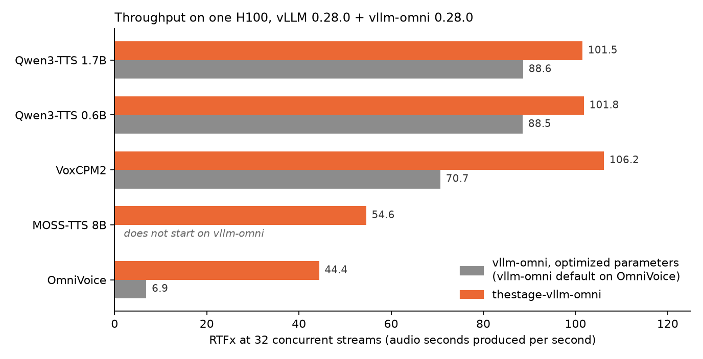
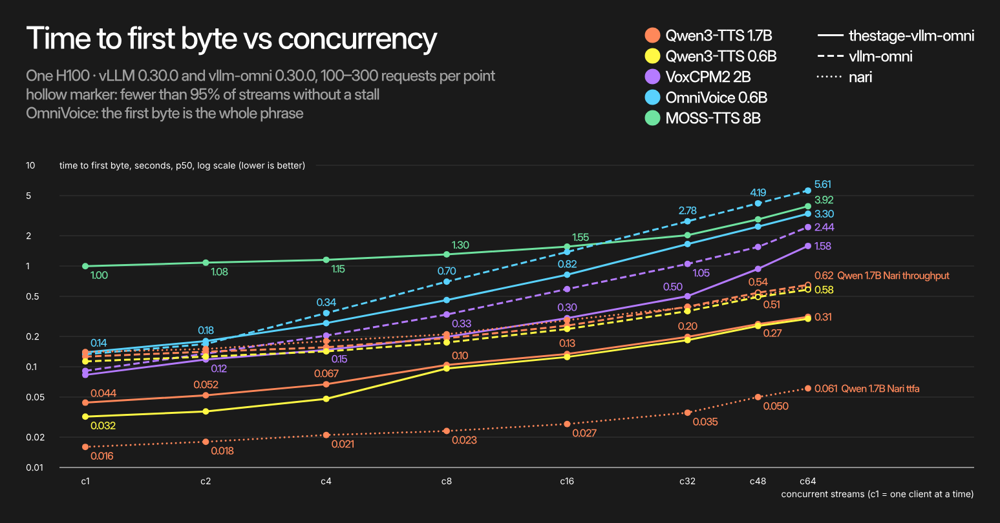
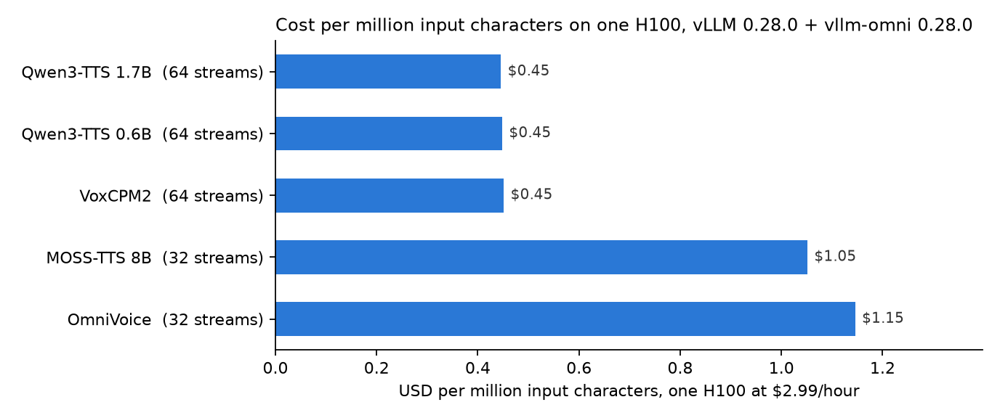

# TheTalker: Serving open text-to-speech models

[](LICENSE)
[](https://github.com/vllm-project/vllm/releases/tag/v0.30.0)
[](https://github.com/vllm-project/vllm-omni/releases/tag/v0.30.0)
[](#support-matrix-and-system-requirements)


## Overview

Model cards report how fast a TTS model synthesizes one utterance offline. They
do not say what happens with thirty-two concurrent clients, whether audio arrives
fast enough to play without gaps, or how many streaming users one GPU sustains.
This repository is the benchmark client that measures that, plus everything
needed to reproduce the measurements.

It contains:

- **A benchmark client** for any server that speaks the OpenAI
  `POST /v1/audio/speech` API with `stream: true` and raw PCM, including
  [vllm-omni](https://github.com/vllm-project/vllm-omni). It records every
  chunk's arrival time and derives RTFx, time to first audio and stream
  continuity from that timeline.
- **Deploy configs**, one per model: the optimal configuration for vllm-omni
  0.30.0, the one the vllm-omni column of the published numbers was measured
  with. Each is a self-contained file shipped as package data and resolved by
  name with `thetalker-deploy`, so a config is one shell substitution away from
  `vllm-omni serve`. thestage-vllm-omni takes no deploy file.
- **Examples**: a downloader for a public-domain reference clip, a serve
  wrapper, a single curl request, a streaming client that prints what a player
  would have heard, a long-text client that splits a chapter into parallel
  sentence requests, a concurrency sweep, a locust load script.
- **Tutorials**:
  [reproducing a table end to end](tutorials/reproduce_benchmarks.md),
  [what each serving parameter does](tutorials/serving_parameters.md),
  [how the streaming metrics are defined](tutorials/streaming_metrics.md), and
  [notes on vllm-omni 0.28.0](tutorials/known_issues_0.28.md).

Five checkpoints are covered: Qwen3-TTS 1.7B and 0.6B CustomVoice, VoxCPM2 2B,
MOSS-TTS 8B and OmniVoice. Word error rate is measured on the Qwen3-TTS Base
checkpoints.

`thestage-vllm-omni`, TheStage AI's serving library for these models, is measured
as a third configuration in the Benchmarks tables. It is a separately licensed,
access-token-gated package, not on PyPI. It ships its own deploy overlays, applies
its own overlay by default once the server is admitted to a TheStage paid session
(Quick start step 2) and `vllm-omni serve` gets no `--deploy-config`, and names them
through a `thestage-vllm-omni-overlay` command. Two of those names, `batch32` and
`tuned`, load to the same configuration as `voxcpm2` and `moss` here through
vllm-omni 0.30.0's own loader, except that the library files name their
`pipeline:` explicitly. On Qwen3-TTS the library column
is measured on its default overlay `qwen3_tts/rtfx` (the same settings as
`chunk75_init16`), which runs the code predictor as one persistent GPU kernel. The Qwen3-TTS and
OmniVoice 0.6B overlays switch on library-only keys, so no config in this repository
reproduces them: that third configuration is not reproducible from this
repository alone.

### Repository layout

```
pyproject.toml     packaging: the thetalker package and its two console scripts
conftest.py        lets pytest import thetalker from a plain checkout
thetalker/         the installable package
  client.py          the load-generating client (CLI: thetalker-bench)
  metrics.py         RTFx, TTFA and continuity math, one implementation
  text.py            sentence splitter behind the long-text example
  deploy_configs.py  config lookup behind thetalker-deploy
  deploy/            5 deploy configs, one per model, for stock vllm-omni
benchmark/
  run_benchmark.py   entry point for a checkout without an install
  gpu_monitor.py     nvidia-smi sampler, peak memory of a served model
  prompts/           Seed-TTS-Eval EN prompt sets (100 / 200 utterances)
  test_*.py          offline tests, no server and no GPU needed
  README.md          protocol, metric definitions, per-table commands
examples/          reference clip, serve, request, streaming client, long text, sweep, locust
tutorials/         reproduction, parameters, metrics, known issues
images/            the figures used below
```

## Table of Contents

- [Features](#features)
- [Quick start](#quick-start)
- [Support Matrix and System Requirements](#support-matrix-and-system-requirements)
- [Usage and Deployment](#usage-and-deployment)
- [Benchmarks](#benchmarks)
- [Enterprise License Summary](#enterprise-license-summary)
- [Contact](#contact)

---

## Features

- **Streaming metrics, not offline ones.** RTFx aggregated over a whole load
  point; time to first audio in two forms, first byte and audible; stream
  continuity, the share of requests a real-time player could have played without
  running dry.
- **Continuity comparable to vllm-omni.** The underrun computation is a verbatim
  port of `vllm_omni/benchmarks/audio_continuity.py::compute_continuity_stats`,
  so a continuity number here means the same thing as one published upstream.
- **Audible time to first audio.** First-byte latency plus the leading silence
  the model itself generates, detected from the PCM. A model that answers in
  80 ms and then plays 300 ms of silence is not a model that answers in 80 ms.
- **A paired A/B protocol.** 300 requests per point after a warmup, both sides of
  a comparison back to back in one session on the same prompts and the same
  arrival schedule, one server at a time on an otherwise empty GPU.
- **Deploy configs as data.** Every vllm-omni configuration measured is a file
  in this repository, resolved by name: `thetalker-deploy qwen3tts17b`. Each
  file's header lists the keys it changes against vllm-omni 0.30.0's own deploy
  file, so the delta of any claim is readable in one screen.
- **Per-request evidence.** `records.jsonl` keeps the full chunk timeline, so any
  aggregate in the tables below can be recomputed or disputed from the raw run.

---

## Quick start

### 1. Install

```shell
git clone https://github.com/TheStageAI/TheTalker.git
cd TheTalker
pip install .[nvidia]
```

`[nvidia]` pulls the serving framework the tables were measured on, vLLM 0.30.0
and vllm-omni 0.30.0, naming the vLLM wheel by URL because the PyPI build
targets CUDA 13. That URL is a direct reference, which is valid for this git or
local install; a published release of `thetalker` cannot carry one in its
metadata and states the same pin as an instruction instead.

The install brings the `thetalker` package with the deploy configs and the
`thetalker-deploy` and `thetalker-bench` commands. Everything else is an
optional group, so a benchmark client on a machine with no GPU stays small:

| Install | Adds | Needed by |
|---|---|---|
| `pip install .` | numpy | the client, `thetalker-deploy`, `thetalker-bench` |
| `pip install .[nvidia]` | vLLM 0.30.0, vllm-omni 0.30.0, `voxcpm` | serving any model here |
| `pip install .[examples]` | `datasets`, `soundfile` | `examples/get_reference.py` (step 3) |
| `pip install .[load]` | `locust`, `requests` | `examples/load_test_locust.py` |
| `pip install .[test]` | `pytest` | `pytest benchmark` |

Groups combine: `pip install .[nvidia,examples]`.

vLLM 0.30.0 brings `flashinfer-python` 0.6.18.post1 with that pin.

Use `pip install -e .[...]` to install in place.

### 2. TheStage AI serving library, optional

`thestage-vllm-omni` is TheStage AI's serving library. It is a separately
licensed, access-token-gated package, not on PyPI. The Benchmarks tables report
it as a third configuration. MOSS-TTS 8B does not start on vllm-omni 0.30.0.
It starts once this library is installed.
```shell
pip install "thestage-vllm-omni==0.1.0" --extra-index-url https://thestage.jfrog.io/artifactory/api/pypi/pypi-thestage-ai-production/simple
```

Go to [app.thestage.ai](https://app.thestage.ai), log in and generate an API
token on your profile page. Make it available to the server:

```shell
export THESTAGE_AUTH_TOKEN=<YOUR_API_TOKEN>
```

The `thestage` CLI (`thestage config set --access-token`) stores the same token
instead, but it pins an older `typer` than vLLM, so install it outside this
environment.

With the token set, `vllm-omni serve <model>
--omni --trust-remote-code` alone serves each model with the library's own
configuration, with no deploy file. The library activates when Python starts and
edits nothing in the installed vllm-omni. The vllm-omni column is vllm-omni
without the library: the `--deploy-config` lines in step 4 carry
`THESTAGE_VLLM_OMNI=0`, which keeps an installed library out of the server.

On Qwen3-TTS one command serves the library with the RTFx profile it was measured
with (the deploy overlay, an MPS daemon started and stopped by the command, server
environment), Qwen3-TTS 1.7B CustomVoice on port 8091:

```shell
thestage-vllm-omni-serve                   # rtfx profile: throughput
```

The rtfx profile serves the `rtfx` overlay (the same settings as
`chunk75_init16`), the overlay the library column below is measured on, plus the
MPS daemon. It is the only serve profile. Plain `vllm-omni serve` starts the same MPS
daemon itself for Qwen3-TTS and MOSS-TTS 8B (not for VoxCPM2 2B and OmniVoice 0.6B, where
MPS is slower); `THESTAGE_VLLM_OMNI_MPS=0` turns it off.

On Qwen3-TTS the library's default configuration runs the code predictor as one
persistent GPU kernel, which ships prebuilt for the H100 SXM. The server log line
`code_predictor: megakernel (buckets ...)` shows it is active; on other GPUs the
library serves the stock code predictor.

### 3. A reference clip

All five checkpoints in step 4 are served in the `Base` task type, which is voice
cloning: every request carries a reference recording of the voice to imitate and
the exact transcript of that recording. What the reference needs to be:

- a mono WAV, 5 to 15 seconds of a single speaker;
- clean: one voice, no music, no overlapping speech;
- accompanied by its transcript, word for word, in the request's `ref_text`;
- recorded at 24 kHz or above. The reference sets the bandwidth of the cloned
  voice, so a 16 kHz recording returns a voice with nothing above 8 kHz whatever
  rate the server outputs.

`examples/get_reference.py` downloads one utterance from LibriTTS-R
test-clean, writes `reference.wav` at 24 kHz and prints its transcript:

```shell
pip install .[examples]
python examples/get_reference.py --out reference.wav
```

Every command below uses `--ref-audio reference.wav` and the transcript that
command prints. Substitute your own recording to clone a different voice.

Checkpoints that ship built-in speakers, such as the Qwen3-TTS CustomVoice
variants, need no reference at all: they take `--task-type CustomVoice` with a
`--speaker` name instead. The speed, first-audio and cost tables use CustomVoice
with speaker Ryan. Cloning models in those tables use one reference clip.

### 4. Serve a model

Each model has two commands, one per column of the Benchmarks tables.

The vllm-omni column is stock vllm-omni 0.30.0 with this repository's deploy file
for the model. `thetalker-deploy <name>` prints the path of that file; without
arguments it lists every name with the model it serves.

```shell
THESTAGE_VLLM_OMNI=0 vllm-omni serve Qwen/Qwen3-TTS-12Hz-1.7B-CustomVoice --omni --trust-remote-code --port 8091 \
    --deploy-config "$(thetalker-deploy qwen3tts17b)"

THESTAGE_VLLM_OMNI=0 vllm-omni serve Qwen/Qwen3-TTS-12Hz-0.6B-CustomVoice --omni --trust-remote-code --port 8091 \
    --deploy-config "$(thetalker-deploy qwen3tts06b)"

# sized for an 80 GB card
THESTAGE_VLLM_OMNI=0 vllm-omni serve openbmb/VoxCPM2 --omni --trust-remote-code --port 8091 \
    --deploy-config "$(thetalker-deploy voxcpm2)"

THESTAGE_VLLM_OMNI=0 vllm-omni serve k2-fsa/OmniVoice --omni --trust-remote-code --port 8091 \
    --deploy-config "$(thetalker-deploy omnivoice)"
```

`THESTAGE_VLLM_OMNI=0` keeps an installed thestage-vllm-omni out of the server;
without the library installed it changes nothing. MOSS-TTS 8B has no vllm-omni
command: it does not start on vllm-omni 0.30.0.

The thestage-vllm-omni column is the same server with thestage-vllm-omni 0.1.0
installed, the token from step 2, and no deploy file:

```shell
vllm-omni serve Qwen/Qwen3-TTS-12Hz-1.7B-CustomVoice --omni --trust-remote-code --port 8091
vllm-omni serve Qwen/Qwen3-TTS-12Hz-0.6B-CustomVoice --omni --trust-remote-code --port 8091
vllm-omni serve openbmb/VoxCPM2 --omni --trust-remote-code --port 8091
vllm-omni serve OpenMOSS-Team/MOSS-TTS --omni --trust-remote-code --port 8091
vllm-omni serve k2-fsa/OmniVoice --omni --trust-remote-code --port 8091
```

`thestage-vllm-omni-serve` serves Qwen3-TTS 1.7B CustomVoice on the library's
RTFx profile (preset voices: pass `--task-type CustomVoice --speaker Ryan` to the
clients). A checkpoint as the first argument, e.g.
`Qwen/Qwen3-TTS-12Hz-1.7B-CustomVoice`, serves that one instead.

Add `--host 0.0.0.0` to serve on the network. The first start compiles kernels
and captures CUDA graphs: about 2 to 9 minutes on an H100 on vllm-omni. With
thestage-vllm-omni the first start takes about 7 minutes on Qwen3-TTS,
8 minutes on VoxCPM2 2B and 12 minutes on MOSS-TTS 8B, which gets an 1800 s
startup budget automatically. Later starts on the same machine take about
3 minutes.

`thetalker-deploy` prints the path of the packaged file itself. Each file is
self-contained, with no `base_config`, so it loads the same whatever deploy
directory the installed vllm-omni ships; copy it before editing. Its header
lists the keys it changes against vllm-omni 0.30.0's own deploy file for the
model.

### 5. Drive it

```shell
python benchmark/run_benchmark.py \
    --port 8091 \
    --texts-jsonl benchmark/prompts/seed_tts_eval_en_100.jsonl \
    --task-type CustomVoice --speaker Ryan \
    --concurrency 8 --requests 300 --warmup 8 --seed 42 \
    --out-dir out/c8
```

---

## Support Matrix and System Requirements

`thetalker-deploy` resolves the configs by the names in the third column: the
deploy file the vllm-omni column was measured with on vllm-omni 0.30.0. The fifth
column is what that file changes against vllm-omni 0.30.0's own deploy file for
the model (`qwen3_tts.yaml`, `voxcpm2.yaml`, `moss_tts.yaml`, `omnivoice.yaml`);
each file's header lists the same keys. The fourth column is the
`thestage-vllm-omni-overlay` name of the configuration the library column is
measured on, which is what the library serves when `vllm-omni serve` gets no
`--deploy-config`.

| Model | Served model id | Deploy config | thestage-vllm-omni overlay | Changes vs vllm-omni 0.30.0 | Model weights | RTFx at 32 streams |
|---|---|---|---|---|---|---|
| Qwen3-TTS 1.7B | `Qwen/Qwen3-TTS-12Hz-1.7B-CustomVoice` | `qwen3tts17b` | `rtfx` | first chunk 1 to 16 frames, chunk 25 to 75, decode-graph batching turned on; model runner v1 and talker token budget 32768, where 0.30.0 ships v2 and 512 | 4.4 GiB | 170.9 |
| Qwen3-TTS 0.6B | `Qwen/Qwen3-TTS-12Hz-0.6B-CustomVoice` | `qwen3tts06b` | `rtfx` | the same keys as the 1.7B | 2.5 GiB | 184.7 |
| VoxCPM2 2B | `openbmb/VoxCPM2` | `voxcpm2` | `batch32` | `max_num_seqs` and decode-graph batch limit 8 to 32 | 4.9 GiB | 102.3 |
| MOSS-TTS 8B | `OpenMOSS-Team/MOSS-TTS` | `moss` | `tuned` | `max_num_seqs` 4 to 32 / 1 to 8, memory split 0.85 / 0.12 to 0.30 / 0.30, stage-1 token budget 196608 to 65536 | 24.5 GiB | 65.4 |
| OmniVoice 0.6B | `k2-fsa/OmniVoice` | `omnivoice` | `batch` | dtype fp32 to bf16; without the `max_num_seqs` 8 and 10 ms request batching 0.30.0 added | 2.2 GiB | 72.5 |

Model weights are the loaded-weight footprint the server reports on an H100 80GB
at the recommended setting, summed over the pipeline's stages; KV cache and
CUDA-graph pools are on top of it and are sized by `gpu_memory_utilization`.
OmniVoice 0.6B on the shipped fp32 configuration is twice the figure shown. RTFx is
also at the recommended setting, which for every model includes
thestage-vllm-omni; see [Benchmarks](#benchmarks) for the split.

Qwen3-TTS and VoxCPM2 2B stream audio chunk by chunk. MOSS-TTS 8B and OmniVoice 0.6B
deliver the whole utterance at the end, so continuity and TTFA are not separable
for them: first audio equals total response time.

`batch32` and `tuned` load to the same configuration as `voxcpm2` and `moss`
here through vllm-omni 0.30.0's loader, except that the library
files name their `pipeline:` explicitly, which vllm-omni otherwise picks from the
model. `thetalker-deploy` accepts them as aliases.
The library's Qwen3-TTS overlay `rtfx` (the same settings as `chunk75_init16`,
also accepted as `chunk75_init16_mk`) starts from the keys of
`qwen3tts17b`, grows the codec chunk through 8, 16 and 32 frames to the
75-frame steady chunk with vllm-omni's own `codec_chunk_ramp` key, and carries
eight library keys that stock vllm-omni ignores: `codec_chunk_ramp_light` and
`codec_chunk_ramp_light_max_inflight` for a shorter first chunk under light load,
`first_chunk_max_per_step` and `first_chunk_priority` for the codec scheduler,
`codec_tail_widths`, `codec_conv_state`, `skip_fixed_bootstrap_frame` and
`code_predictor_megakernel`. No config in this repository
reproduces that overlay or OmniVoice 0.6B's `batch`.

What each of those keys does, and how the CUDA-graph capture ladder is derived:
[tutorials/serving_parameters.md](tutorials/serving_parameters.md). Why MOSS-TTS 8B
needs thestage-vllm-omni on 0.30.0, the 0.28.0 history, and why
`voxcpm2` is an 80 GB config: [tutorials/known_issues_0.28.md](tutorials/known_issues_0.28.md).

### System requirements

- **Measured on:** one NVIDIA H100 80GB SXM. Every number below is from that
  card.
- **Supported GPUs:** any NVIDIA GPU vLLM supports and the model fits on. The
  deploy configs pin concurrency and memory settings chosen for an 80GB card; on
  a smaller card serve vllm-omni's own deploy file for the model.
- **Driver:** 580 as measured; CUDA 12.9 wheels.
- **Operating system:** Ubuntu 20.04 or later.
- **Python:** 3.10-3.12 for the benchmark client; vllm-omni 0.30.0 itself needs
  3.11 or later.
- **Client host:** the benchmark client needs no GPU and no vllm-omni; numpy is
  its only dependency.

---

## Usage and Deployment

### Serve

```shell
examples/serve.sh qwen3tts17b 8091
```

The wrapper serves the vllm-omni column: it resolves the config with
`thetalker-deploy`, picks the checkpoint that config was measured with
(`MODEL=<hf-id>` overrides it) and sets `THESTAGE_VLLM_OMNI=0`, so an installed
thestage-vllm-omni stays out of the server.

On the library, no deploy file:

```shell
vllm-omni serve Qwen/Qwen3-TTS-12Hz-1.7B-CustomVoice --omni --trust-remote-code --port 8091
thestage-vllm-omni-serve                   # Qwen3-TTS, rtfx profile
```

### One request

A request is an OpenAI `audio/speech` call. For a voice-cloning checkpoint it
carries the reference clip and its transcript (Quick start step 3); the reply is
24 kHz mono PCM.

The body is piped rather than passed as an argument: a 10 s reference clip is
about 600 KB of base64, and the kernel caps a single argument at 128 KB, so
inlining it in `-d "{...}"` fails with "Argument list too long".

```shell
REF_AUDIO=reference.wav
REF_TEXT="<the transcript of that recording, word for word>"

{
    printf '{"input": "The quick brown fox jumps over the lazy dog.", '
    printf '"task_type": "Base", "language": "English", '
    printf '"ref_audio": "data:audio/wav;base64,'
    base64 -w0 "$REF_AUDIO"
    printf '", "ref_text": "%s", ' "$REF_TEXT"
    printf '"stream": true, "stream_format": "audio", "response_format": "pcm"}'
} | curl -sS http://127.0.0.1:8091/v1/audio/speech \
    -H 'Content-Type: application/json' \
    --data-binary @- --output out.pcm
```

The same call is in `examples/request.sh`. `task_type` selects the mode a
checkpoint supports: `Base` clones the reference clip, `CustomVoice` takes a
preset `speaker`, `VoiceDesign` takes an `instructions` description.

### Streaming

`examples/run_streaming.py` sends one streaming request, writes the audio to a
WAV, and reports what a player would have heard: first-byte latency, audible
latency, and whether playback would have stalled.

```shell
python examples/run_streaming.py \
    --ref-audio reference.wav --ref-text "<the transcript of that recording>" \
    --text "The quick brown fox jumps over the lazy dog." \
    --out out.wav
```

The server streams raw PCM at the model's own rate and the client writes the WAV
header from `--sample-rate`, default 24000. VoxCPM2 2B streams at 48000 Hz: pass
`--sample-rate 48000` for it (to the streaming example and to
`thetalker-bench`), or the recording plays slowed down and pitched low.
`thetalker-deploy --sample-rate <name>` prints the rate of the model a config serves:

```shell
python examples/run_streaming.py --sample-rate "$(thetalker-deploy --sample-rate voxcpm2)" ...
```

It prints one block per request:

```
wrote out.wav (<audio seconds> in <n> chunks)
TTFA first byte : <seconds>
TTFA audible    : <seconds> (leading silence <seconds>)
longest gap     : <seconds>
playback        : no stall | WOULD HAVE STALLED -- worst underrun <seconds>
```

### Long texts

One request is one stream, so a long text sent whole is synthesized sequentially
and pays the single-client price. Voice-agent frameworks such as LiveKit Agents
and Pipecat split the text by sentence before it reaches the TTS server.
`examples/run_long_text.py` does the same: it splits the text into sentences,
sends them in parallel, joins the audio in text order and prints when each part
arrived.

```shell
python examples/run_long_text.py \
    --ref-audio reference.wav --ref-text "<its transcript>" \
    --text-file <the text file> --concurrency 8 --out chapter.wav
```

It prints one row per part and then the run:

```
part  chars  first byte s   done s
   0    <n>       <seconds> <seconds>
   ...
wrote <the out file>
parts                 : <n> at concurrency <n>
total wall time       : <seconds>
total audio           : <seconds>
first audio byte      : <seconds>
sequential upper bound: <seconds>
```

The upper bound is the sum of the parts' own request times, which were measured
while the parts competed for the GPU. `--compare-sequential` replaces it with a
measured second pass that sends the same parts one after another:

```
sequential wall time  : <seconds> (measured, one part after another)
```

A part that fails is reported in its row and left out of the WAV, and the script
exits non-zero.

### Load

`examples/run_sweep.sh` runs the benchmark protocol at c8 and c32 against a
running server. `examples/load_test_locust.py` holds a server under open-loop
locust load and reports time to first audio separately from total response time.

---

## Benchmarks

Five open TTS checkpoints on one H100, measured on vLLM 0.30.0 with vllm-omni
0.30.0. Speed, first audio and cost for Qwen3-TTS are CustomVoice with speaker
Ryan. Word error rate is on the Base checkpoints. Full protocol and per-table
commands: [benchmark/README.md](benchmark/README.md). What the metrics mean:
[tutorials/streaming_metrics.md](tutorials/streaming_metrics.md). One model
reproduced end to end:
[tutorials/reproduce_benchmarks.md](tutorials/reproduce_benchmarks.md).

### Throughput

RTFx is audio seconds per wall-clock second at 32 concurrent streams, and higher
is better. vllm-omni runs the deploy file from this repository.
thestage-vllm-omni runs its RTFx profile, with no deploy file passed.
Qwen3-TTS 1.7B Nari is a third server on the 1.7B checkpoint.

| Model | vllm-omni | thestage-vllm-omni |
|---|---|---|
| Qwen3-TTS 1.7B | 122.7 | 170.9 |
| Qwen3-TTS 0.6B | 131.0 | 184.7 |
| VoxCPM2 2B | 69.3 | 102.3 |
| MOSS-TTS 8B | n/a | 65.4 |
| OmniVoice 0.6B | 43.3 | 72.5 |

Setup: H100 80GB, vLLM 0.30.0 + vllm-omni 0.30.0, torch 2.13 / CUDA 12.9,
driver 580, Seed-TTS-Eval EN, 300 requests at 32 streams after a warmup.
RTFx = audio seconds per wall-clock second, higher is better. Qwen3-TTS is
CustomVoice, speaker Ryan. The ratio of thestage-vllm-omni to vllm-omni is 1.4x
on Qwen3-TTS 1.7B, 1.4x on Qwen3-TTS 0.6B, 1.5x on VoxCPM2 2B and 1.7x on OmniVoice.
n/a: MOSS-TTS 8B does not start on vllm-omni.
Qwen3-TTS 1.7B Nari throughput and Qwen3-TTS 1.7B Nari ttfa are both 138.2 RTFx
here. At 64 streams they are 181.2 and 143.6.



The grey bars are vllm-omni. The yellow bars are thestage-vllm-omni. The orange
bar is Qwen3-TTS 1.7B Nari. MOSS-TTS 8B has no grey bar.

### Stream continuity

On Qwen3-TTS, vllm-omni stays at or above 95% continuity through 32 streams. It
drops below that level at 48 streams and at 64 streams, on both sizes.
thestage-vllm-omni holds 100% continuity at every load. Qwen3-TTS 1.7B Nari
throughput and Qwen3-TTS 1.7B Nari ttfa hold 100% continuity at every load.
VoxCPM2 2B holds 100% continuity on both servers.

Setup: H100 80GB, vLLM 0.30.0 + vllm-omni 0.30.0, torch 2.13 / CUDA 12.9,
Seed-TTS-Eval EN. Continuity = share of streams delivered without a stall.

### First audio under load



Each line is the median time from sending the request to the first audio byte,
from 1 to 64 concurrent streams. A hollow marker is a point where fewer than 95%
of streams played without a stall. Hollow markers appear on vllm-omni for both
Qwen sizes, at 48 streams and at 64 streams.

For one client, Qwen3-TTS 1.7B Nari ttfa is 0.016 s. At 32 streams it is 0.035 s.
At that load, thestage-vllm-omni on this checkpoint is 0.20 s and vllm-omni is
0.40 s. Qwen3-TTS 1.7B Nari throughput is 0.39 s.

On Qwen3-TTS 0.6B, thestage-vllm-omni is 0.03 s for one client. At 32 streams it
is 0.18 s. vllm-omni is 0.36 s at that load.

OmniVoice 0.6B returns the whole utterance, so its first audio byte is that response
time. At 8 streams, thestage-vllm-omni is 0.46 s. On vllm-omni it is 0.70 s.
MOSS-TTS 8B returns the whole utterance too. At 8 streams its first audio byte is
1.3 s. VoxCPM2 2B at 32 streams has a first byte of 0.50 s on thestage-vllm-omni
and 1.05 s on vllm-omni.

Setup: H100 80GB, vLLM 0.30.0 + vllm-omni 0.30.0, torch 2.13 / CUDA 12.9,
Seed-TTS-Eval EN. First byte is the median from request sent to first audio byte,
in seconds, lower is better. Qwen3-TTS is CustomVoice, speaker Ryan.

### Cost



Each model is priced at 32 concurrent streams on thestage-vllm-omni, and only
where continuity is at least 95%. The price is the H100 hour at $2.99 divided by
the characters delivered in that hour, times a million, and lower is better.
Qwen3-TTS 1.7B is $0.36 per million input characters. Qwen3-TTS 0.6B is $0.40.
VoxCPM2 2B is $0.51. OmniVoice 0.6B is $0.70. MOSS-TTS 8B is $0.88.

Setup: H100 80GB, vLLM 0.30.0 + vllm-omni 0.30.0, torch 2.13 / CUDA 12.9,
driver 580, Seed-TTS-Eval EN, 300 requests at 32 streams. Qwen3-TTS is
CustomVoice, speaker Ryan. Characters are input text, counted over requests
delivered without a stall.

### Quality

Word error rate, in percent, lower is better: each sentence is synthesized,
transcribed back with whisper-large-v3 and compared with the text that was sent.

| Model | WER, % |
|---|---|
| Qwen3-TTS 1.7B-Base | 1.50 ± 0.59 |
| Qwen3-TTS 0.6B-Base | 1.21 ± 0.52 |
| VoxCPM2 2B | 0.92 ± 0.46 |
| MOSS-TTS 8B | 1.50 ± 0.56 |
| OmniVoice 0.6B | 1.16 ± 0.52 |

Setup: H100 80GB, 200 Seed-TTS-Eval EN sentences per model, on the Base
checkpoints named in the table. The value pools the whole set, total word edits
divided by total reference words, and the number after ± is half of a 95%
interval bootstrapped over sentences. The same sentences on vllm-omni land
inside these intervals. WER measures intelligibility and says nothing about
voice similarity. The pipeline is described in
[benchmark/README.md](benchmark/README.md#quality-word-error-rate).

### Methodology

One NVIDIA H100 80GB SXM, one server at a time, GPU verified empty before each
run. Closed loop: `cN` means N requests in flight, a new one issued as each
finishes. Scored requests are 100 at 1 stream, 100 at 2, 200 at 4, and 300 from
8 streams through 64, after a warmup. Qwen3-TTS speed, first audio and cost use
CustomVoice with speaker Ryan. Models that clone a voice use one 4.6 s reference
clip. RTFx = audio seconds produced per wall-clock second, higher is better.
TTFA = time to first audio in seconds, lower is better. Continuity = share of
requests whose audio never fell behind real-time playback. The full protocol,
the metric definitions and the command for every table are in
[benchmark/README.md](benchmark/README.md). The reasoning behind the metric
choices is in [tutorials/streaming_metrics.md](tutorials/streaming_metrics.md),
and a walk-through of one model is in
[tutorials/reproduce_benchmarks.md](tutorials/reproduce_benchmarks.md).

---

## Enterprise License Summary

The client, the deploy configs, the examples and the tutorials in this repository
are MIT. TheStage AI's serving library is licensed separately. For a commercial
license, or to deploy TheStage AI's inference engine in your environment, contact
us here: [Service request](https://app.thestage.ai/contact).

| Component | What it is | Status | License |
|---|---|---|---|
| This repository | Benchmark client, deploy configs, examples, tutorials | ✅ Stable | MIT |
| thestage-vllm-omni | TheStage AI serving library for these models | ✅ Stable | Licensed separately |
| vLLM, vllm-omni | The serving framework being measured | Upstream | Apache-2.0 |
| `benchmark/prompts/` | Seed-TTS-Eval English utterances, redistributed | Upstream | [Seed-TTS-Eval](https://github.com/BytedanceSpeech/seed-tts-eval) terms, not MIT |

---

## Contact

- Library: [thestage-vllm-omni](https://thestage.jfrog.io/artifactory/api/pypi/pypi-thestage-ai-production/simple/thestage-vllm-omni/)
- Platform: [app.thestage.ai](https://app.thestage.ai)
- Subscribe: [TheStageAI on X](https://x.com/TheStageAI)
- Email: contact@thestage.ai
